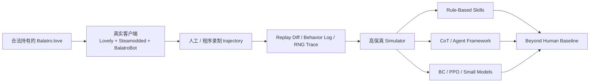

# hack-balatro

<p align="center">
  
</p>

<p align="center">
  <strong>不是做一个“差不多能玩”的 Balatro 克隆。</strong><br />
  我们要做的是一个以真实客户端为金标准、能被严格验真的 Balatro 智能实验场。
</p>

<p align="center">
  目标很直接：<strong>Beyond Human Baseline</strong>。<br />
  不管是 rule-based skill、CoT、工具型 Agent 框架，还是轻量模型与强化学习，能打通、能稳定、能超人类，就是值得推进的路线。
</p>

## 这项目到底在做什么

`hack-balatro` 是一个围绕 Balatro 的高保真环境重建与智能体研究项目。

它同时做三件事：

- 逆向并重建 Balatro 的状态机、动作语义、计分链、Joker 触发顺序、Boss/Shop side effects 与 RNG 消耗顺序。
- 用真实客户端 trajectory、replay diff、behavior log 和 source oracle 去验证模拟环境，而不是只看“最后分数像不像”。
- 在一个可信环境上并行尝试多种通关路线，包括但不限于：
  - rule-based agent / skill system
  - CoT / tool-using agent / 多 Agent 框架
  - behavior cloning、PPO 与其他训练管线
  - 轻量化、小规模模型的策略学习与决策增强

一句话概括：

> 先证明环境演得和原版一模一样，再去想办法让 AI 比人类更会玩。

## 北极星

- 真实客户端是唯一金标准。
- 当前阶段的目标不是“先做一个近似 simulator 顶着”，而是做出和原版 Balatro 一致的环境。
- `100% trajectory match` 才算 fidelity 通过。
- 不接受“最终分数差不多”。
- 不接受“多数 case 正确”。
- 不接受“看起来差不多能玩”。

如果 simulator 和真实客户端不一致，我们默认 simulator 错了。

详细计划见 [Plan/trajectory-plan.md](./Plan/trajectory-plan.md)，行为约束见 [Agent-Style.md](./Agent-Style.md)。

## 一张图看清主线



## 为什么这项目很有意思

- 它不是单纯的 RL 训练项目，也不是单纯的游戏逆向项目，而是两者叠加后的硬核版本。
- Balatro 的难点不是“能不能出牌”，而是状态切换、触发顺序、商店副作用、随机性和组合爆炸。
- 这意味着你不能只靠一个“看起来能打”的环境；你需要一个可以被 replay 和 trajectory 真正锤过的环境。
- 一旦环境可信，这里就会变成一个很适合做 Agent 研究的试验场：
  - 搜索型策略可以试
  - rule-based policy 可以试
  - 工具增强型智能体可以试
  - 小模型蒸馏、轻量推理、行为克隆、RL 都可以试
- 最终目标不是做一个 demo，而是把每个盲注阶段、每种资源决策、每类 Joker 组合都打到超越人类的稳定水位。

## 我们会尝试的方法

| 路线 | 会怎么用 | 为什么重要 |
| --- | --- | --- |
| Rule-based skills | 手写策略、启发式规则、可解释决策器 | 快速建立强 baseline，也适合做 simulator 对拍 |
| CoT / Tool-using Agent | 让模型显式分析牌型、经济、Boss 风险与 shop 决策 | 用推理换更强的局部规划能力 |
| 多 Agent / 框架化探索 | 分工处理策略评估、候选动作打分、回放验证 | 适合复杂局面下的组合决策 |
| BC / PPO / 小模型训练 | 用轨迹、对局与奖励信号训练轻量策略 | 把“能解释”进一步推进到“能规模化打” |
| Replay Harness / Diff Audit | 对同一 seed 与动作序列做端到端一致性检查 | 这是环境可信度的硬门槛，不是附属功能 |

## 当前核心能力

这个仓库现在已经不只是一个空壳 scaffold。核心基础设施已经在持续补齐：

- `crates/balatro-spec`：版本化 ruleset bundle schema / loader
- `crates/balatro-engine`：结构化 snapshot / action / transition engine
- `crates/balatro-py`：PyO3 绑定，向 Python 暴露 `balatro_native`
- `scripts/probe_real_client_env.py`：探测本机真实 Balatro 客户端录制链路是否就绪
- `scripts/record_manual_real_trajectory.py`：人工录制真实 trajectory
- `scripts/build_source_oracle.py`：基于源码生成 source oracle
- `scripts/diff_replays.py`：同 seed / 同动作序列下做 replay diff
- `scripts/audit_replay.py`：做 replay 审计，检查硬约束与 fidelity-ready 条件
- `scripts/run_fidelity_coverage.py`：覆盖 boss / shop / consumable 等关键链路
- `viewer/`：本地 replay / state inspector

## 快速开始

### 1. 本地引导

```bash
python scripts/bootstrap_balatro_source.py
python scripts/build_ruleset_bundle.py
cargo test
```

### 2. 复现实验主链路

```bash
python scripts/repro.py phase1
python scripts/repro.py phase2 --strategy strategy_stable
```

### 3. 其他常用命令

```bash
python scripts/repro.py phase2 --strategy strategy_reward_boost
python scripts/repro.py phase2 --strategy strategy_transformer
python scripts/repro.py resume --strategy strategy_stable --resume checkpoints/latest.pt
python scripts/repro.py eval --ppo-checkpoint checkpoints/best.pt
python scripts/repro.py report --metrics results/<run_id>/phase2_metrics.json
```

### 4. 原生回放与资产检查

```bash
python scripts/bootstrap_balatro_source.py
python scripts/build_ruleset_bundle.py
python scripts/extract_balatro_assets.py --dest results/assets-preview
python scripts/record_replay.py --output results/replay.json
open viewer/index.html
```

## 真实 trajectory 录制链路

这里最关键的不是“把游戏跑起来”，而是把真实客户端里的动作与状态可靠落盘。

推荐流程：

1. 探测真实客户端环境：

```bash
python scripts/probe_real_client_env.py --output results/real-client-bootstrap.json
```

2. 启动真实客户端服务：

```bash
uvx balatrobot serve --fast
```

3. 做健康检查：

```bash
curl -X POST http://127.0.0.1:12346 \
  -H "Content-Type: application/json" \
  -d '{"jsonrpc":"2.0","method":"health","id":1}'
```

4. 录一条真实 session：

```bash
python scripts/record_manual_real_trajectory.py \
  --session-dir results/real-client-trajectories/manual-001 \
  --deck RED \
  --stake WHITE \
  --seed 123456
```

只打开游戏窗口不算成功。只有真实 trajectory 被写入 `results/real-client-trajectories/`，这条链路才算真正打通。

## Fidelity 通过标准

只有在同一 `seed`、同一动作序列下，同时做到下面这些，环境才算可信：

- 动作合法性一致
- 状态转移一致
- `chips / mult / dollars` 一致
- `hand / deck / discard / jokers / consumables` 一致
- `blind / shop / reroll / skip` side effects 一致
- Joker 触发顺序一致
- RNG 结果一致

只要任意一步偏离，就不能把这个环境包装成“已经对齐原版”。

## 仓库结构

- `env/`：Gym wrapper、动作空间、状态编码
- `crates/`：Rust 侧 spec / engine / Python binding
- `agents/`：Random / Greedy / 其他策略 agent
- `training/`：BC、rollout buffer、PPO trainer、curriculum、phase pipeline
- `eval/`：评测与对比指标
- `scripts/`：doctor / repro / train / eval / diff / audit 入口
- `viewer/`：回放与状态查看器
- `fixtures/`：ruleset 与相关固定资产
- `results/`：replay、审计结果、coverage 输出
- `vendor/`：本地合法持有的上游依赖与源包

## 协作约定

- 使用 Codex 修改仓库时，优先为每个会话使用独立的 `git worktree`，因为很可能会有多个 Codex 窗口并行编辑。
- 进度需要定期落盘，不要等“全做完”才记录。
- 每次 checkpoint / handoff 都要带明确时间戳和时区。
- 如果最近一次记录或推送已经超过 `12h`，优先把当前连贯进度推到远端。

## 额外说明

- 受版权约束，带授权的 Balatro 包不会直接进入 git。每位协作者都应从自己的本地安装中引导：

```bash
python scripts/bootstrap_balatro_source.py
```

- 默认引导目标是 `vendor/balatro/steam-local/`，该目录保持忽略，可随时重新生成。
- 团队引导细节与期望 hash 见 `docs/licensed-source-bootstrap.md`。
- `fixtures/ruleset/balatro-1.0.1o-full.json` 由本地 `Balatro.love` 与 Balatro Wiki Joker 表共同生成。
- `BalatroEnv` 会优先使用 `balatro_native`，不可用时再回退到 `pylatro` 或 deterministic mock。

## 最后一句

这不是一个“做个代理玩卡牌”的轻项目。

这是在搭一条完整的链路：

从真实客户端取证，到 simulator 验真，到策略研究、训练、压测，再到真正意义上的 `Beyond Human Baseline`。
