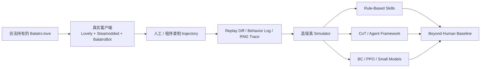

# hack-balatro

<p align="center">
  
</p>

<p align="center">
  <strong>不是做一个"差不多能玩"的 Balatro 克隆。</strong><br />
  我们要做的是一个以真实客户端为金标准、能被严格验真的 Balatro 智能实验场。
</p>

<p align="center">
  目标很直接：<strong>Beyond Human Baseline</strong>。
</p>

---

## 环境模拟进度

### 引擎总览

| 指标 | 状态 |
|------|------|
| Rust engine (`balatro-engine`) | 8,037 行, **104 测试全绿** |
| Python binding (`balatro_native`) | PyO3, 全功能暴露 |
| 性能 | **15,504 steps/sec** (engine only), 31 games/sec |
| 审计 | **zero error, zero warning**, fidelity_ready = true |
| 确定性 | 同 seed 同动作 → 0 mismatch |

### 已实现的游戏系统

| 系统 | 状态 | 覆盖度 |
|------|------|--------|
| 核心流程 (Blind → Shop → Cashout → Ante → GameOver) | ✅ | 100% |
| 150 Joker 效果 (`apply_joker_effect`) | ✅ | 150/150 match arms |
| 28 Scaling Joker (`runtime_state` 累积/衰减) | ✅ | 28/28 |
| Retrigger (Red Seal / Blueprint chain / Seltzer) | ✅ | 全部 |
| Card Enhancement 计分 (Bonus/Mult/Wild/Glass/Steel/Stone/Gold/Lucky) | ✅ | 8/8 |
| Edition 计分 (Foil/Holo/Polychrome/Negative) | ✅ | 4/4 |
| Boss Blind 特殊效果 (debuff/restriction/penalty) | ✅ | 14 real + 14 stub |
| Consumable: Tarot (22 张) | ✅ | 22/22 |
| Consumable: Planet | ✅ | 全部 |
| Consumable: Spectral (17 张) | ✅ | 17/17 |
| Voucher 系统 (10 种永久升级) | ✅ | 10/10 |
| Booster Pack (Arcana/Celestial/Buffoon/Standard/Spectral) | ✅ | 5/5 |
| Enhanced 卡片生成 (edition/enhancement/seal 概率) | ✅ | Shop + Pack |
| 3 激活阶段 (held-in-hand / end-of-round / boss-select) | ✅ | 19 Joker |
| joker_on_played 阶段 (Space/DNA/ToDoList/Midas) | ✅ | 4/4 |

### 数值审计结果

```
Structural audit:   0 errors, 0 warnings
Money conservation: 318/318 passed
Score monotonicity:  68/68  passed
Hand/discard track:  45/45  passed
Joker count check:    5/5   passed
```

### 尚未实现

| 缺失项 | 影响 |
|--------|------|
| 真实客户端 trajectory 录制 | 所有验证仍是 engine 自对照 |
| ~14 个复杂 Boss Blind (Crimson Heart, Amber Acorn 等) | 这些 Boss 出现时退化为普通 Blind |
| chips/mult trace 对比 | 审计有框架但 engine 尚未输出 final_chips/final_mult |

---

## 实验进度

### PPO 训练管道

训练基础设施已完整搭建并跑通端到端验证：

| 组件 | 状态 |
|------|------|
| Gym Wrapper (`BalatroEnv`) | ✅ 支持 balatro_native 后端 |
| State Encoder | ✅ **576-dim** obs (含 enhancement/edition/boss/voucher/consumable) |
| PPO Agent (MLP / Transformer) | ✅ 334K params (MLP-256) |
| Rollout Buffer + GAE | ✅ |
| PPO Trainer | ✅ |
| Reward Shaping | ✅ blind clear +1, boss +3, ante +2, win +10, loss -1, 经济 +0.01/$ |
| 实验报告系统 | ✅ `results/training/<exp>/report.json` + `metrics.csv` |

### 首次实验：smoke_test_v1

| 指标 | 数值 |
|------|------|
| 环境 | 4 envs × 128 steps × 20 updates = 10,240 steps |
| 耗时 | **27.5s** |
| 时间分布 | env 采集 95.1% / PPO 训练 2.8% / overhead 2.1% |
| 吞吐量 | **373 steps/sec** (含 model forward) |
| 设备 | Apple MPS (M-series GPU) |
| 模型 | MLP 2×256, **334,423 params** |
| 最终 mean reward | -0.97 |
| 最终 mean ante | 1.0 |
| 最终 entropy | 1.94 |

> 这是 10K 步的冷启动结果。agent 仍在随机探索，尚未学到有效策略。这次实验的目的是验证管道，不是训练出强 agent。

### 性能评估

| 场景 | 吞吐量 | 是否瓶颈 |
|------|--------|----------|
| Engine only (Rust) | 15,504 steps/sec | 否 |
| Engine + Model forward (MPS) | 373 steps/sec | 95% 在此 |
| PPO backward pass | 26 updates/sec | 否 |
| 预估 1M steps | ~45 min | 可接受 |
| 预估 10M steps | ~7.5 hr | 需要更好的 batch 效率或服务器 |

---

## 一张图看清主线



## 快速开始

### 1. 本地引导

```bash
python scripts/bootstrap_balatro_source.py
python scripts/build_ruleset_bundle.py
cargo test
```

### 2. 构建 native extension

```bash
pip install maturin
maturin develop --manifest-path crates/balatro-py/Cargo.toml
```

### 3. 录制 replay 并审计

```bash
python scripts/record_replay.py --seed 42 --policy simple_rule_v1 --max-steps 500 --output results/replay.json
python scripts/audit_replay.py --replay results/replay.json --output results/audit.json
```

### 4. 跑一次 PPO 训练

```bash
python scripts/train_smoke.py --num-envs 4 --num-updates 50 --exp-name my_first_run --save-checkpoint
# 结果输出到 results/training/my_first_run/
```

## 仓库结构

```
crates/
  balatro-spec/       版本化 ruleset bundle schema / loader
  balatro-engine/     结构化 snapshot / action / transition engine (8K lines, 104 tests)
  balatro-py/         PyO3 绑定 → balatro_native
env/
  balatro_gym_wrapper.py    Gym wrapper
  state_encoder.py          576-dim observation encoder
  action_space.py           86-dim action space
agents/
  simple_rule_agent.py      Rule-based baseline (reaches Ante 4)
  ppo_agent.py              PPO agent (MLP / Transformer)
training/
  ppo.py                    PPO trainer
  rollout.py                Rollout buffer + GAE
  pipeline.py               Full training pipeline
scripts/
  train_smoke.py            PPO 训练 + 实验报告
  record_replay.py          录制 replay
  audit_replay.py           结构 + 数值审计
  diff_replays.py           同 seed 确定性 diff
fixtures/
  ruleset/                  生成的 ruleset bundle (150 Jokers)
results/
  training/                 实验报告 (report.json + metrics.csv)
  replay-fidelity.audit.json  最新审计结果
```

## Fidelity 通过标准

只有在同一 `seed`、同一动作序列下，同时做到下面这些，环境才算可信：

- 动作合法性一致
- 状态转移一致
- `chips / mult / dollars` 一致
- `hand / deck / discard / jokers / consumables` 一致
- `blind / shop / reroll / skip` side effects 一致
- Joker 触发顺序一致
- RNG 结果一致

## 下一步 Backlog

见 [todo/20260331_backlog.md](./todo/20260331_backlog.md)。当前 TOP 3：

1. **正式 PPO 训练** — 100K+ steps，调参（entropy_coef, reward scale），观察 agent 是否能学会过 Ante 2
2. **Vectorized env** — 当前 env 采集占 95% 时间，batch 化 env.step 可显著提升吞吐
3. **真实客户端 trajectory 录制** — 项目金标准，需要 Steamodded + Lovely + BalatroBot

## 协作约定

- 使用 Codex 修改仓库时，优先为每个会话使用独立的 `git worktree`
- 进度需要定期落盘，每次 checkpoint 带明确时间戳和时区
- 受版权约束，Balatro 包不进 git，每位协作者从本地安装引导：`python scripts/bootstrap_balatro_source.py`
