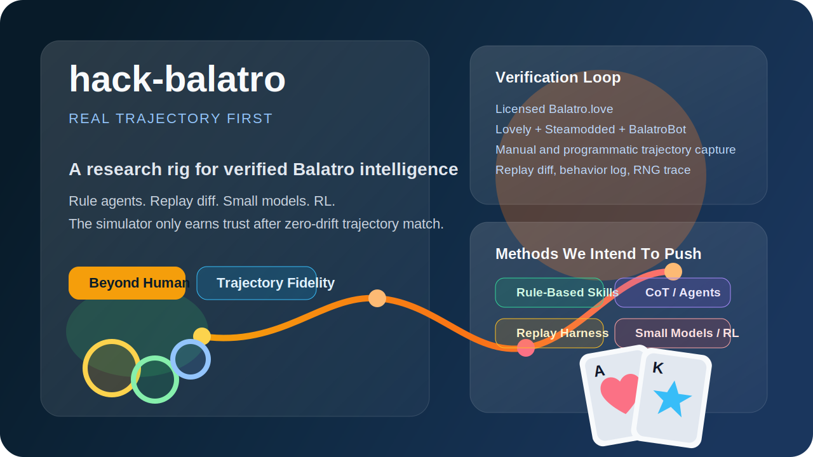
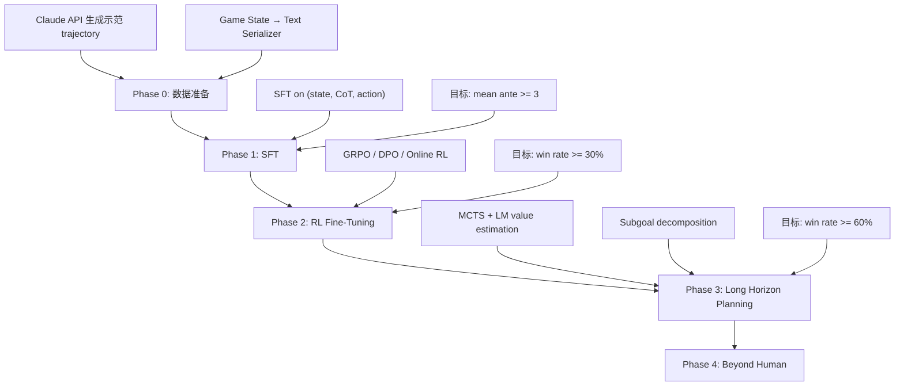

# hack-balatro

<p align="center">
  
</p>

<p align="center">
  <strong>不是做一个"差不多能玩"的 Balatro 克隆。</strong><br />
  我们要做的是一个以真实客户端为金标准、能被严格验真的 Balatro 智能实验场。
</p>

<p align="center">
  目标很直接：<strong>Beyond Human Baseline</strong>。
</p>

---

## 环境模拟进度

### 引擎总览

| 指标 | 状态 |
|------|------|
| Rust engine (`balatro-engine`) | 8,037 行, **104 测试全绿** |
| Python binding (`balatro_native`) | PyO3, 全功能暴露 |
| 性能 | **15,504 steps/sec** (engine only), 31 games/sec |
| 审计 | **zero error, zero warning**, fidelity_ready = true |
| 确定性 | 同 seed 同动作 → 0 mismatch |

### 已实现的游戏系统

| 系统 | 状态 | 覆盖度 |
|------|------|--------|
| 核心流程 (Blind → Shop → Cashout → Ante → GameOver) | ✅ | 100% |
| 150 Joker 效果 (`apply_joker_effect`) | ✅ | 150/150 match arms |
| 28 Scaling Joker (`runtime_state` 累积/衰减) | ✅ | 28/28 |
| Retrigger (Red Seal / Blueprint chain / Seltzer) | ✅ | 全部 |
| Card Enhancement 计分 (Bonus/Mult/Wild/Glass/Steel/Stone/Gold/Lucky) | ✅ | 8/8 |
| Edition 计分 (Foil/Holo/Polychrome/Negative) | ✅ | 4/4 |
| Boss Blind 特殊效果 (debuff/restriction/penalty) | ✅ | 14 real + 14 stub |
| Consumable: Tarot (22 张) | ✅ | 22/22 |
| Consumable: Planet | ✅ | 全部 |
| Consumable: Spectral (17 张) | ✅ | 17/17 |
| Voucher 系统 (10 种永久升级) | ✅ | 10/10 |
| Booster Pack (Arcana/Celestial/Buffoon/Standard/Spectral) | ✅ | 5/5 |
| Enhanced 卡片生成 (edition/enhancement/seal 概率) | ✅ | Shop + Pack |
| 3 激活阶段 (held-in-hand / end-of-round / boss-select) | ✅ | 19 Joker |
| joker_on_played 阶段 (Space/DNA/ToDoList/Midas) | ✅ | 4/4 |

### 数值审计结果

```
Structural audit:   0 errors, 0 warnings
Money conservation: 318/318 passed
Score monotonicity:  68/68  passed
Hand/discard track:  45/45  passed
Joker count check:    5/5   passed
```

### 尚未实现

| 缺失项 | 影响 |
|--------|------|
| 真实客户端 trajectory 录制 | 所有验证仍是 engine 自对照 |
| ~14 个复杂 Boss Blind (Crimson Heart, Amber Acorn 等) | 这些 Boss 出现时退化为普通 Blind |
| chips/mult trace 对比 | 审计有框架但 engine 尚未输出 final_chips/final_mult |

---

## 实验进度

### PPO 训练管道 🚧 legacy (retired 2026-04-24)

> 本路线已退役。主接口见下文「LLM 训练环境接口」。历史代码 frozen 在
> `env/legacy/` / `legacy/training/` / `scripts/legacy/` / `agents/legacy/`，
> 复活指引：[`env/legacy/README.md`](./env/legacy/README.md)。

训练基础设施曾完整搭建并跑通端到端验证：

| 组件 | 状态 |
|------|------|
| Gym Wrapper (`BalatroEnv`) | 🚧 legacy (`env/legacy/balatro_gym_wrapper.py`) |
| State Encoder | 🚧 legacy **576-dim** obs (`env/legacy/state_encoder.py`) |
| PPO Agent (MLP / Transformer) | 🚧 legacy 334K params (`agents/legacy/ppo_agent.py`) |
| Rollout Buffer + GAE | 🚧 legacy (`legacy/training/rollout.py`) |
| PPO Trainer | 🚧 legacy (`legacy/training/ppo.py`) |
| Reward Shaping | 🚧 legacy blind clear +1, boss +3, ante +2, win +10, loss -1, 经济 +0.01/$ |
| 实验报告系统 | 🚧 legacy `results/training/<exp>/report.json` + `metrics.csv` |

### 首次实验：smoke_test_v1

| 指标 | 数值 |
|------|------|
| 环境 | 4 envs × 128 steps × 20 updates = 10,240 steps |
| 耗时 | **27.5s** |
| 时间分布 | env 采集 95.1% / PPO 训练 2.8% / overhead 2.1% |
| 吞吐量 | **373 steps/sec** (含 model forward) |
| 设备 | Apple MPS (M-series GPU) |
| 模型 | MLP 2×256, **334,423 params** |
| 最终 mean reward | -0.97 |
| 最终 mean ante | 1.0 |
| 最终 entropy | 1.94 |

### PPO 实验总结（6 次，930K 总步数）

| 实验 | Steps | 结果 | 发现 |
|------|-------|------|------|
| smoke_test_v1 | 10K | ante=1.0 | entropy collapse |
| entropy_05 | 100K | ante=1.0 | 稳定了但不 play |
| step_penalty | 100K | ante=1.0 | 惩罚无效 |
| strong_score | 100K | ante=1.0 | score reward 太弱 |
| play_bonus | 100K | ante=1.0 | bonus 太小 |
| play_03 | 500K | ante=1.0 | 刷 play bonus，reward hacking |

**结论**：vanilla PPO 无法在 Balatro 的 toggle-based action space 上冷启动学习。零训练的手写 LLM 策略过了 2/3 blind，500K PPO 过了 0 个。

### 方向转向：Small LM + Long Horizon Planning

Balatro 是一个推理游戏，不是反射游戏。选牌、经济管理、Joker synergy、Boss 应对都是 planning 问题。

**新方向**：用小参数量语言模型（~23B）作为 agent 大脑：
- 推理能力相对较弱，但可以通过 SFT 习得 Balatro 领域知识
- 适合做 Long Horizon Reasoning and Planning 的研究载体
- 推理成本可控，可以大量采样和迭代
- 输出 chain-of-thought，决策过程完全可解释

---

## 训练路线图



| Phase | 目标 | 方法 | 成功标准 |
|-------|------|------|----------|
| **0. 数据准备** | 高质量 trajectory 数据集 | Claude API 玩 100+ 局，输出 CoT + action | 有 30+ 局过 Ante 4 |
| **1. SFT** | 23B 模型习得 Balatro 决策 | LoRA fine-tuning on (state, reasoning, action) | mean ante >= 3 |
| **2. RL** | 用环境反馈进一步提升 | GRPO/DPO/PPO on LM | win rate >= 30% |
| **3. Planning** | 跨多步前瞻规划 | MCTS + LM eval, subgoal decomposition | win rate >= 60% |
| **4. Beyond Human** | 各 stake 超越人类 | Multi-stake 泛化, Joker synergy 发现 | — |

---

## 一张图看清主线


## Balatro 源码 & 研究授权

本仓库在 **获得官方科研授权** 的前提下，随仓库直接分发 Balatro 1.0.1o 的原始资源：

```
vendor/balatro/
├── LICENSE_NOTE.md                    # 授权范围 + 使用约束
└── steam-local/
    ├── manifest.json                  # SHA256 + 元数据
    ├── original/Balatro.love          # 53 MB 原始游戏包
    └── extracted/                     # 47 个解包 Lua 文件（3.8 MB）
        ├── game.lua                   # 权威规则源
        ├── blind.lua, card.lua, tag.lua, main.lua
        ├── functions/                 # state_events, UI, common_events 等
        ├── engine/                    # controller, event, node 等
        └── localization/              # 15 种语言
```

**合作者可以直接 clone 开始工作**，无需再从本地 Steam 安装引导。

授权范围 / 使用约束详见 [`vendor/balatro/LICENSE_NOTE.md`](./vendor/balatro/LICENSE_NOTE.md)。

## 快速开始

### 1. 本地引导（使用已随仓库分发的源码）

```bash
python scripts/build_ruleset_bundle.py   # 从 vendor/balatro 生成 ruleset
cargo test                                # 验证引擎
```

> 如果你从自己的 Steam 安装重建源码（而非使用仓库内的版本），先跑
> `python scripts/bootstrap_balatro_source.py`

### 2. 构建 native extension

```bash
pip install maturin
maturin develop --manifest-path crates/balatro-py/Cargo.toml
```

### 3. 录制 replay 并审计

```bash
python scripts/record_replay.py --seed 42 --policy simple_rule_v1 --max-steps 500 --output results/replay.json
python scripts/audit_replay.py --replay results/replay.json --output results/audit.json
```

### 4. 交互式跑一局 (LLM 主接口)

```bash
python scripts/sim_repl.py --seed 42 --deck red --stake 1 --lang en
# 每步打印状态 + 合法动作；输入序号推进，用于验证仿真端到端
```

## 仓库结构

```
crates/
  balatro-spec/       版本化 ruleset bundle schema / loader
  balatro-engine/     结构化 snapshot / action / transition engine (8K lines, 104 tests)
  balatro-py/         PyO3 绑定 → balatro_native
env/
  state_serializer.py       文本化 state (LLM 主接口)
  canonical_trajectory.py   统一 trajectory schema (LLM / sim REPL / real client)
  locale.py                 英/中文翻译
  state_mapping.py          snapshot 字段映射
  legacy/                   🚧 已退役的 Gym wrapper + encoder + action_space
agents/
  base.py                   Agent Protocol
  random_agent.py           Random baseline
  legacy/                   🚧 已退役的 simple_rule / greedy / PPO agents
legacy/
  training/                 🚧 已退役的 PPO trainer / rollout / BC pipeline
scripts/
  sim_repl.py               交互式 REPL（人类 / LLM 主接口验证）
  llm_play_game.py          LLM 自动跑 trajectory
  record_replay.py          录制 replay
  audit_replay.py           结构 + 数值审计
  diff_replays.py           同 seed 确定性 diff
  legacy/                   🚧 已退役的 train_smoke / train_ppo / eval_run 等
configs/
  legacy/                   🚧 已退役的 PPO yaml
fixtures/
  ruleset/                  生成的 ruleset bundle (150 Jokers)
results/
  replay-fidelity.audit.json  最新审计结果
```

## Fidelity 通过标准

只有在同一 `seed`、同一动作序列下，同时做到下面这些，环境才算可信：

- 动作合法性一致
- 状态转移一致
- `chips / mult / dollars` 一致
- `hand / deck / discard / jokers / consumables` 一致
- `blind / shop / reroll / skip` side effects 一致
- Joker 触发顺序一致
- RNG 结果一致

## Balatro 核心机制速查

> 完整规则见 [rules/balatro_guide_for_llm.md](./rules/balatro_guide_for_llm.md)

### 游戏流程

```
Ante 1-8，每层 3 个盲注：Small → Big → Boss
每个盲注：选牌 → 出牌/弃牌 → 达标过关 → 商店 → 下一个
```

### 计分

```
得分 = (基础筹码 + 计分牌筹码) × (基础倍率 + 加法倍率) × 乘法倍率
```

| 牌型 | 筹码 | 倍率 | 牌型 | 筹码 | 倍率 |
|------|------|------|------|------|------|
| High Card | 5 | ×1 | Flush | 35 | ×4 |
| Pair | 10 | ×2 | Full House | 40 | ×4 |
| Two Pair | 20 | ×2 | Four of Kind | 60 | ×7 |
| Three of Kind | 30 | ×3 | Straight Flush | 100 | ×8 |
| Straight | 30 | ×4 | | | |

### 关键约束

- **出牌次数 = 0 时不能打牌**，弃牌也无法改变结局
- 弃牌唯一作用是换牌（消耗弃牌次数，从牌堆抽新牌）
- 利息：每持有 $5 回合末 +$1（上限 $5）
- 小丑上限 5 个，消耗品上限 2 个
- Boss Blind 不能跳过，有 20 种特殊负面效果

---

## Real client integration (as of 2026-04-20)

### What we did

We wired the actual Steam Balatro game up to the research tooling. When you play a real game now, we can record every play, discard, shop purchase, and boss encounter as structured data, five times per second. The recording runs quietly alongside the game; nothing about how you play changes. When you're done, one command turns the raw recording into the same shape the simulator and the LLM agents produce, so everything downstream (training, evaluation, sim-vs-real comparison) can treat real games and simulated games identically.

### Why it matters

- **Ground truth for fidelity.** The simulator has been checked only against itself. Real client trajectories let us assert the simulator matches the actual game, chip for chip.
- **Real human-play data.** A few hours of your play seeds an imitation-learning corpus no scripted policy can match — real decisions under real uncertainty.
- **Planner-quality evaluation.** Once we can diff real vs simulated, we can evaluate any agent (LLM, RL, scripted) by how closely it reproduces strong human play.

### How to try it (<5 minutes)

Open two terminals in this repo.

**Terminal 1 — start the modded game:**
```bash
bash scripts/launch_modded_balatro.sh
```
This kills any old Balatro, backs up incompatible save files, launches the game with the observer hooks loaded, and waits until the game is ready. Exits cleanly with the Balatro window open.

**Terminal 2 — start recording, then play:**
```bash
python scripts/experimental/observe_real_play.py \
    --session my-first-session --interval 0.2
```
Now just play a normal game in the Balatro window. When you're done (whether you win, lose, or just want to stop), quit Balatro and press `Ctrl-C` in Terminal 2.

**Convert the recording to canonical form:**
```bash
python scripts/adapt_observer_to_canonical.py \
    --session results/real-client-trajectories/my-first-session
```
That writes `trajectory.canonical.json` next to your raw recording. That file is the one downstream tools consume.

### What we learned from the first run

We captured one complete Ante 2 loss (seed `4WAX5M4D`, RED deck, WHITE stake): 56 raw events, 20 canonical steps, all 5 hands fully reconstructed with per-card detail. No false-positive discards after the round-boundary bug was fixed. The polling loop is the current bottleneck — very fast inputs (<200 ms) can still slip through.

**The actual recording is checked into the repo** so you can open it without running anything:

```
results/real-client-trajectories/observer-20260420T223706/
├── trajectory.canonical.json   ← start here (20 structured steps, human-readable)
├── events.jsonl                ← raw event stream (56 lines, one event per line)
├── snapshots/tick-000010.json … tick-000210.json   ← 21 full game-state dumps
└── meta.json                   ← session metadata
```

Open `trajectory.canonical.json` to see every play, every shop buy, every tarot use as a single structured step — this is the exact format downstream tools (training, evaluation, the upcoming sim-vs-real diff) will consume. **Note:** this is the only observer session we share by default; future sessions stay local unless we explicitly whitelist them.

### What comes next (needed from you)

Before we move to Phase P2 (the simulator-vs-real diff tool), we need **5-10 complete games** recorded over the next week. Please try to cover the checklist below across all your sessions combined (you don't need to hit everything in one run):

- **Hand types played at least once:** High Card, Pair, Two Pair, Three of a Kind, Straight, Flush, Full House, Four of a Kind, Straight Flush.
- **Consumables used at least once each:** one Tarot, one Planet, one Spectral.
- **Booster packs:** open at least one of each type — Standard, Buffoon, Arcana, Celestial, Spectral.
- **Bosses faced:** at least 3 different boss blinds.
- **Progression:** reach Ante 3 or higher at least once.
- **Outcomes:** at least one win + at least one loss.
- **Blind choices:** skip the small blind in one run, play it normally in another.

Keep the default settings (RED deck, WHITE stake) for comparability unless we ask otherwise.

### Limitations to know about

- The polling-based observer can miss rapid inputs shorter than ~200 ms (e.g., instantly reselecting a card).
- The simulator-vs-real comparison tool isn't built yet — arriving in Phase P2, after the corpus is large enough.
- The launch + recording scripts currently only work on **macOS Apple Silicon**. Windows support tracked separately.

### TODO — Decision-divergence annotation (planned)

After a session is recorded, we want to go through each **meaningful human decision point** and annotate it with the AI's own choice + reasoning, so the delta becomes training signal, not just an audit trail.

Scope per decision point (for each play / discard / shop buy / blind skip / tarot target):

1. **What the human did** — the action as captured by the observer.
2. **What the AI would have done** — an explicit alternative (or "same"), produced by replaying the pre-decision state into a policy.
3. **Reasoning trade-off** — short prose: the pros and cons of each branch, grounded in current game state (score needed, hands/discards left, joker synergies, upcoming boss). Written from the AI's point of view so the model can learn the weighing.
4. **Retrospective label** — after the session ends, mark whose choice looked correct in hindsight (human / AI / ambiguous / either works).

Deliverable when built:
- `scripts/annotate_divergence.py` — reads a canonical trajectory, produces `divergence.jsonl` with one row per decision point.
- A curated page per session in `results/real-client-trajectories/<session>/divergence.md` for human review.
- Feeds into training: divergent-choice + CoT reasoning is high-signal supervised data.

Dependencies: canonical trajectory adapter (done), simulator-vs-real diff (P2, pending), a first-pass policy (P3). First version can be hand-written for 1-2 sessions to pin down the schema before automating.

_Full architecture + test plan: see [`todo/20260420_real_client_integration_plan.md`](./todo/20260420_real_client_integration_plan.md)._

---

## LLM 训练环境接口

仓里已经为 LLM 智能体搭好 2 层 API。**默认都是英文输出**，LLM 训练数据保持语种不变；人类调试想看中文另外切。

> 历史的 Gym 风格接口（`BalatroEnv`、576-dim state encoder、PPO trainer）已于 2026-04-24 退役，
> 移至 `env/legacy/` / `legacy/training/` / `scripts/legacy/` / `agents/legacy/`。
> 复活指引：[`env/legacy/README.md`](./env/legacy/README.md)。

### 1. 文本化状态（`env/state_serializer.py`）—— 给 LLM 读

```python
from env.state_serializer import serialize_state
text = serialize_state(snapshot, legal_actions)   # 默认英文
text = serialize_state(snapshot, legal_actions, lang="zh")   # 中文（需要 fixtures/locale/zh_CN.json）
```

输出样例（英文默认）：
```
[STAGE] PreBlind | Small Blind
[ANTE] 1 | Round 1
[RESOURCES] Plays: 4 | Discards: 3 | Money: $4
[HAND] 5S | KH | 9C | ...
[JOKERS] Walkie Talkie | To Do List | ...
[SHOP JOKERS] Swashbuckler($4) | Space Joker($5) ...
[LEGAL ACTIONS] select_card_0, select_card_1, play, discard, ...
```

`lang="zh"` 会把所有标签和 joker/tag/blind/牌型/consumable 名翻成中文。

### 2. 86 维离散动作空间 🚧 legacy (`env/legacy/action_space.py`)

> 常量保留作为 action-index 的历史参考，RL 路线已退役；主接口通过
> `engine.handle_action_index(idx)` 直接接受同一套索引。

```
 0..7    select_card_0 .. select_card_7     (选/取消选卡)
 8       play                               (出牌)
 9       discard                            (弃牌)
10..12   select_blind_0/1/2                 (选 small/big/boss)
13       cashout                            (领奖)
14..23   buy_shop_item_0 .. 9               (买商店)
24..46   move_left_0 .. 22                  (reorder 手牌)
47..69   move_right_0 .. 22
70       next_round                         (出 shop)
71..78   use_consumable_0 .. 7
79       reroll_shop
80..84   sell_joker_0 .. 4
85       skip_blind
```

### LLM 交互一轮的完整链路

```
┌──────────────────────────────────┐
│ 1. Engine.snapshot()             │  Rust sim 出原始 state
└──────────────┬───────────────────┘
               ▼
┌──────────────────────────────────┐
│ 2. serialize_state(snap, legal)  │  → 文本 + 合法动作列表
└──────────────┬───────────────────┘
               ▼
   LLM prompt: 文本 + 推理指令
               │
               ▼
       "{reasoning, action: 'play'}"   ← LLM 输出动作名
               │
               ▼
┌──────────────────────────────────┐
│ 3. action_name → action_idx      │  `balatro_native.action_label` 反向查
│ 4. Engine.step(idx)              │  Rust 推进 → Transition
└──────────────────────────────────┘
               │
               ▼
       记 {step, state_text, reasoning, action,
           score_before, score_after} → trajectory
```

每把游戏结束，trajectory 落盘到 `results/trajectories/llm_claude_code/game_NNNN.json`，作为下游训练数据。

### 交互式 CLI（人类测试用）

```bash
python scripts/sim_repl.py --seed 42 --deck red --stake 1 --lang en
# --lang zh 切中文；其他参数：--seed-str DEMO42 / --max-steps 500
```

启动后每步打印状态 + 枚举合法动作；输入序号推进。用来验证仿真环境端到端能跑——用的就是 LLM 的同一条接口，玩一局 = 校验一次 LLM 交互链。

---

## 下一步 Backlog

见 [todo/20260331_backlog.md](./todo/20260331_backlog.md)

## 协作约定

- 使用 Codex 修改仓库时，优先为每个会话使用独立的 `git worktree`
- 进度需要定期落盘，每次 checkpoint 带明确时间戳和时区
- 受版权约束，Balatro 包不进 git，每位协作者从本地安装引导：`python scripts/bootstrap_balatro_source.py`
